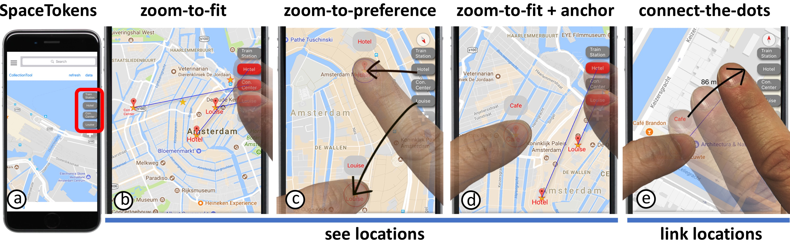

# SpaceTokens: Interactive Map Widgets for Location-centric Interactions

[Daniel Miau](http://www.cs.columbia.edu/~dmiau), [Steven Feiner](http://www.cs.columbia.edu/~feiner)

*Proceedings of the 2018 CHI Conference on Human Factors in Computing Systems, April, 2018*<br/>
Project pages:<br/>
http://www.cs.columbia.edu/~dmiau/projects/SpaceTokens/


SpaceTokens make locations first-class citizens of map interaction. (a) Four SpaceTokens (gray rectangles with rounded corners), each representing a location. SpaceTokens empower users to use locations directly to address "seeing" and "linking" problems discussed in paper. For example, users can (b) tap SpaceTokens to make corresponding locations visible; (c) drag SpaceTokens onto map, so corresponding locations snap to positions of dragged SpaceTokens; (d) hold an on-screen location (using left thumb) and tap several SpaceTokens to see their relative positions; (e) link an on-screen location to a SpaceToken using LinkTool (bubble above left thumb). LinkTools in (c--e) also serve as visible labels for locations being touched.

## Download
```bash
git clone https://github.com/dmiau/SpaceTokens.git
```
## Build and Run
This is an iOS (xcode) project. Load the project file SpaceTokens.xcodeproj, then build and run the project as any standard xcode projects.

## Contact
Please contact [Daniel Miau](http://www.cs.columbia.edu/~dmiau) if you have questions or comments.
